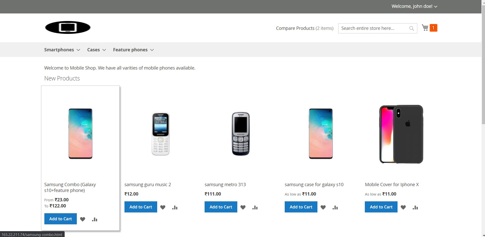
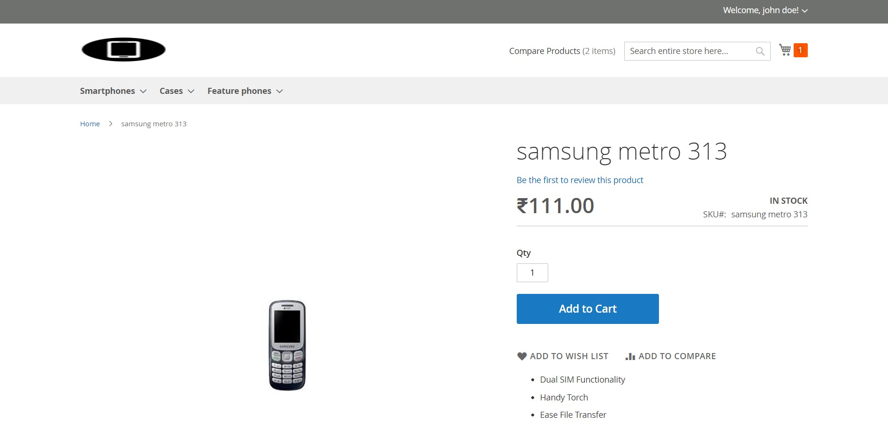
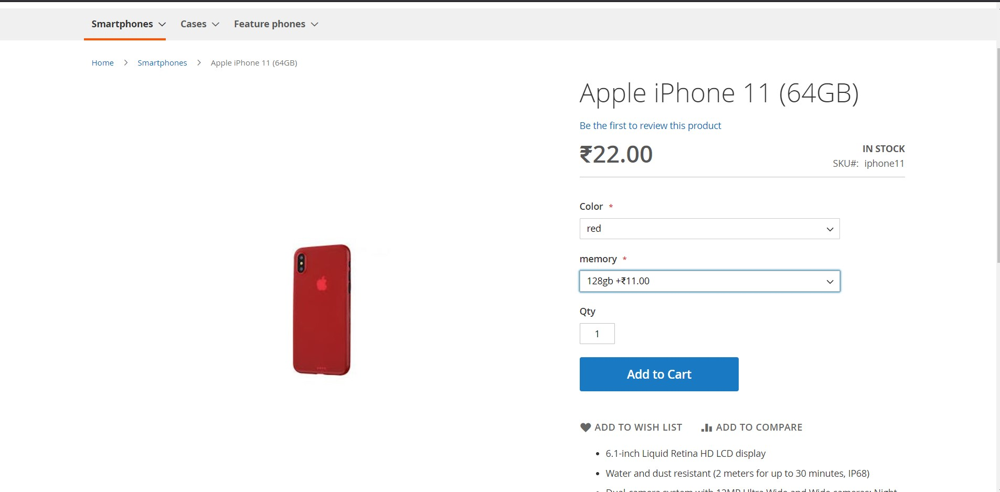
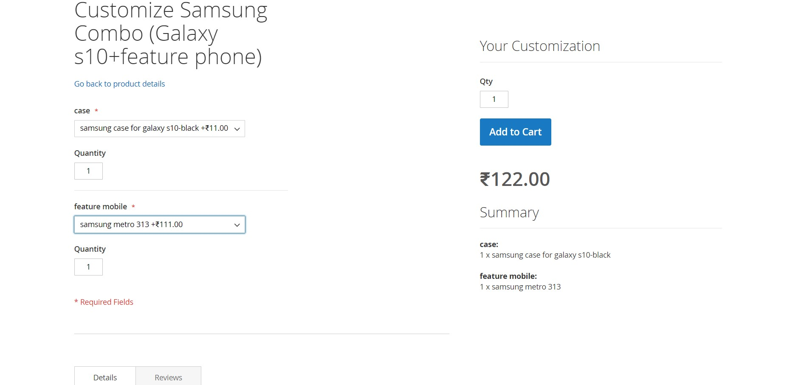
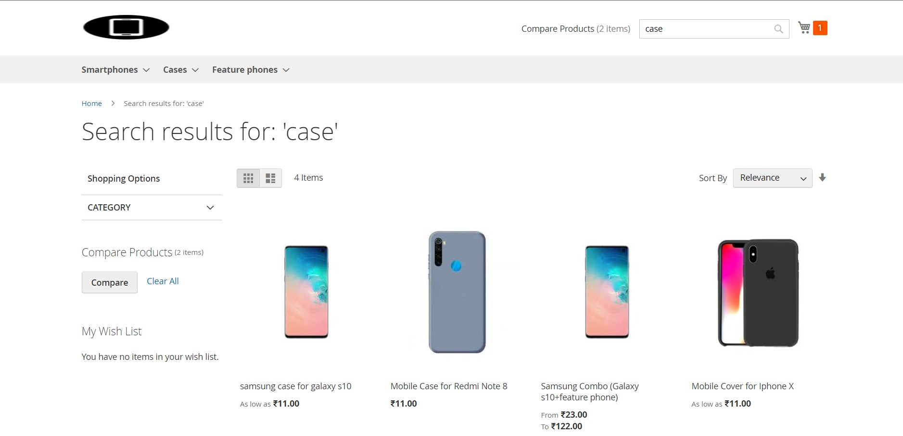
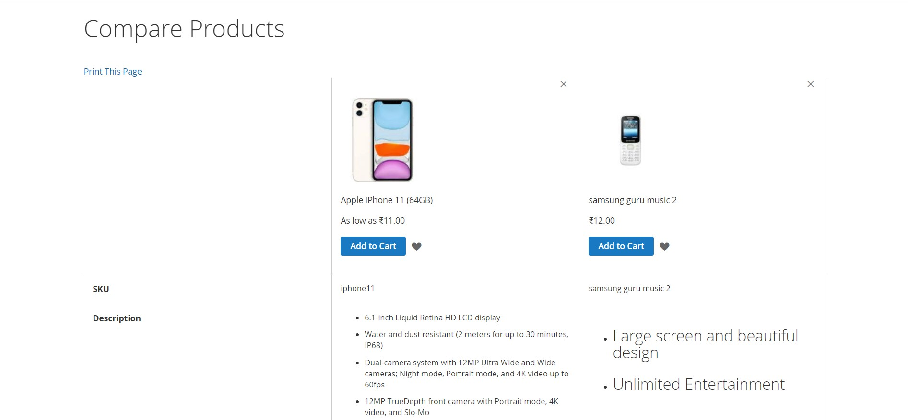
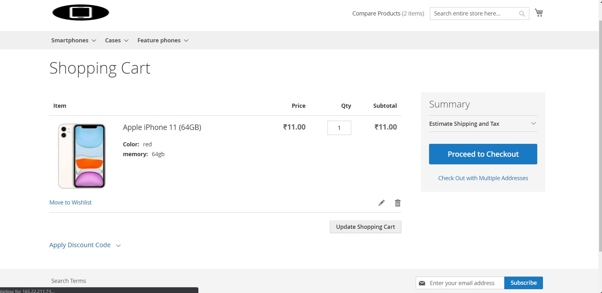

# mobile-shop-magento
a demo mobile shop built using magento 2.3.4
demo store is live and can be accesed by going to http://165.22.211.74/. the web server is hosted on digital ocean droplet.
<ul>
<li>Has customer sign in,sign up, my cart, Add to wishlist features</li>
</ul>

<h2><b>Home Page</b></h2>

 3 categories of products are available- smartphones, covers/cases and feature phones

<h2> Products are also of 3 types </h2>
<ul>
<li>
<h3>Simple products</h3>

</li>
<li>
<h3>Configerable Products</h3>

 User can select different configerations such as memory size and color for a particular product.

</li>
<li>
<h3>Bundled Products </h3>

 Products are bundled together with many options between them. i.e. suitable for combo offers or when products are bought together 

</li>
</ul>
<h2> Search any product . SEO is also used . Products can be filtered using attributes like color,manufacturer of the product. </h2>

<h2> 2 or more products can also be compared side by side </h2>

<h2> shopping cart of a user </h2>

 shipping has also been configured, billing has not been configured as it is ONLY a demo site, no actual sales is going on.

